# ChoiceNet
TensorFlow Implementation of ChoiceNet on regression tasks. 

### Summarized result: [click](https://rawgit.com/sjchoi86/choicenet/master/html/reg_results.html)
### Paper: [arxiv](https://arxiv.org/abs/1805.06431)

### Result
<html><body><table><caption> Reference Function: [cosexp] </caption><tr><th> name </th><th> Training Data </th><th> Multi-Layer Perceptron </th><th> Mixture Density Network </th><th> ChoiceNet </th></tr><tr><td>oRate: 0.0%</td><td>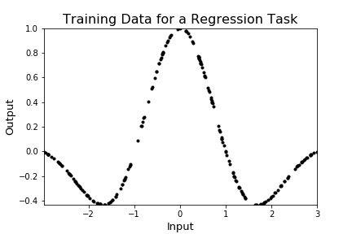</td><td>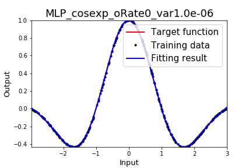</td><td>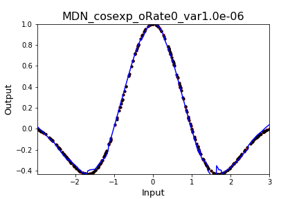</td><td>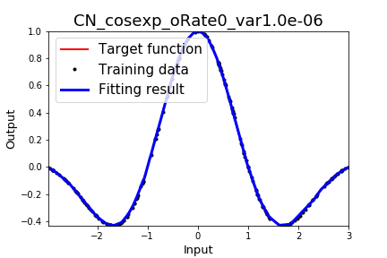</td></tr><tr><td>oRate: 10.0%</td><td></td><td>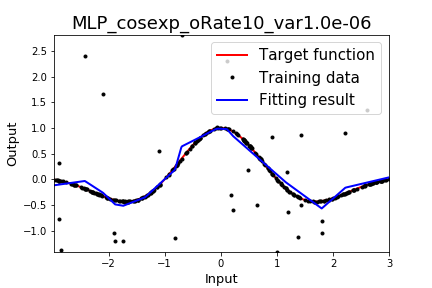</td><td>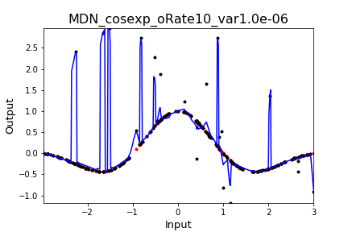</td><td>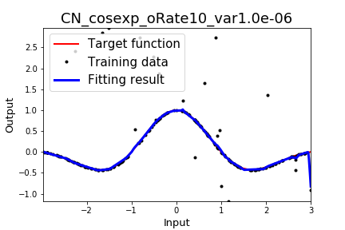</td></tr><tr><td>oRate: 30.0%</td><td></td><td></td><td>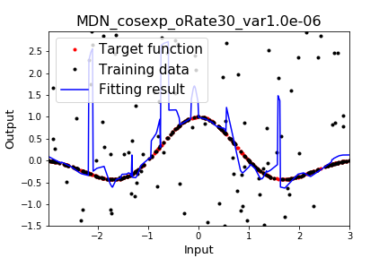</td><td>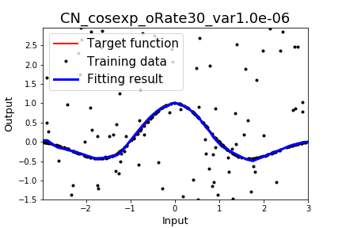</td></tr><tr><td>oRate: 50.0%</td><td>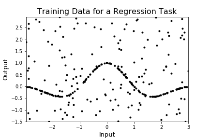</td><td>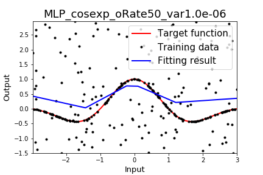</td><td>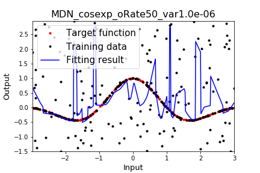</td><td>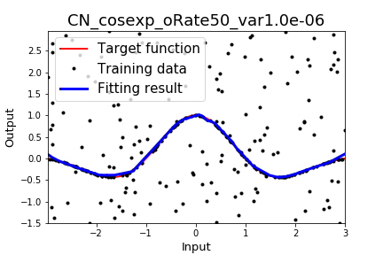</td></tr><tr><td>oRate: 60.0%</td><td></td><td>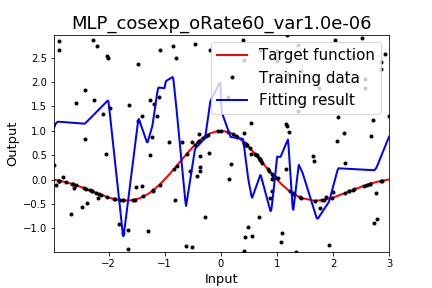</td><td>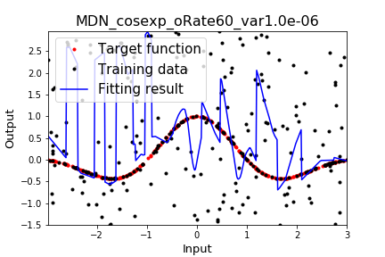</td><td>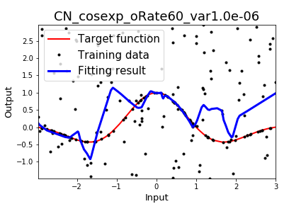</td></tr><tr><td>oRate: 70.0%</td><td></td><td>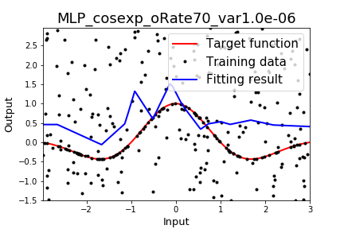</td><td>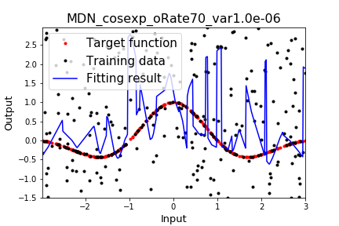</td><td>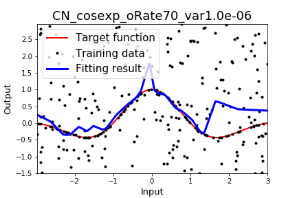</td></tr><br></body></table><body><table><caption> Reference Function: [linear] </caption><tr><th> name </th><th> Training Data </th><th> Multi-Layer Perceptron </th><th> Mixture Density Network </th><th> ChoiceNet </th></tr><tr><td>oRate: 0.0%</td><td></td><td>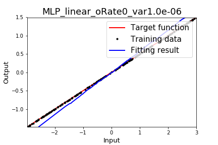</td><td>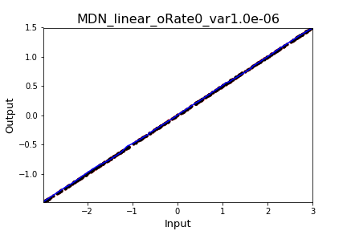</td><td>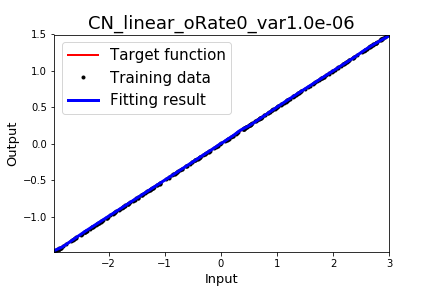</td></tr><tr><td>oRate: 10.0%</td><td></td><td>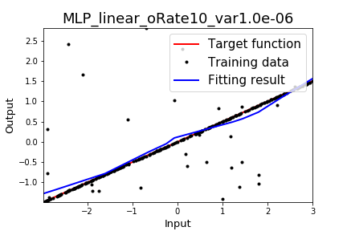</td><td>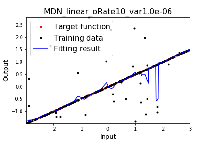</td><td>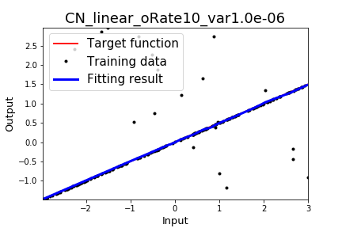</td></tr><tr><td>oRate: 30.0%</td><td></td><td></td><td>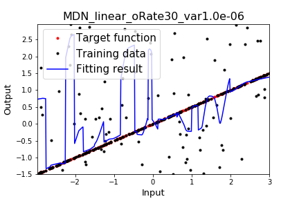</td><td>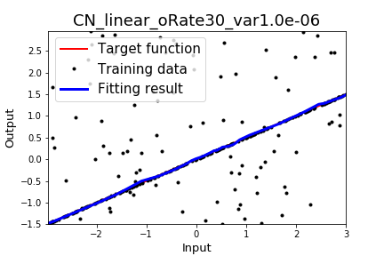</td></tr><tr><td>oRate: 50.0%</td><td></td><td>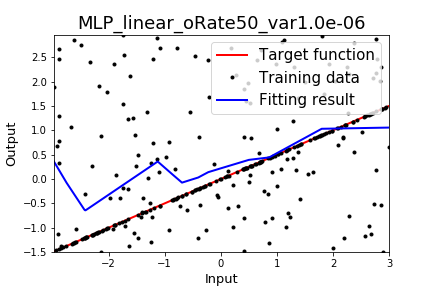</td><td>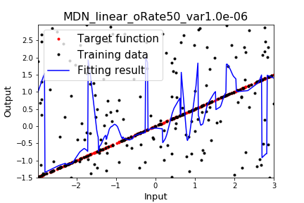</td><td>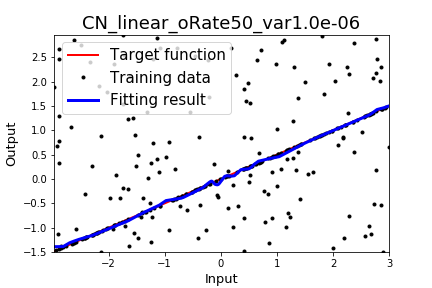</td></tr><tr><td>oRate: 60.0%</td><td></td><td>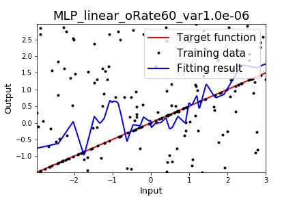</td><td>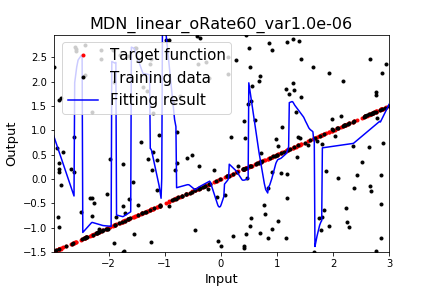</td><td>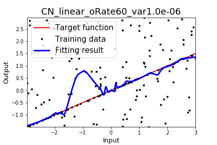</td></tr><tr><td>oRate: 70.0%</td><td>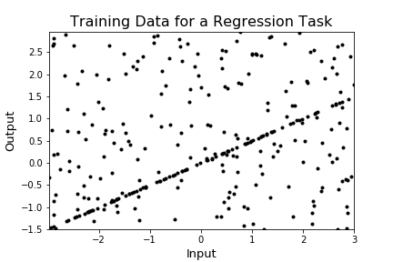</td><td>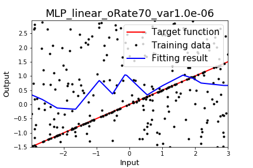</td><td>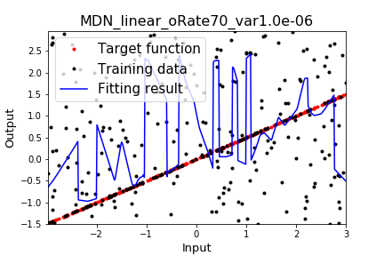</td><td>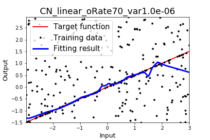</td></tr><br></body></table><body><table><caption> Reference Function: [step] </caption><tr><th> name </th><th> Training Data </th><th> Multi-Layer Perceptron </th><th> Mixture Density Network </th><th> ChoiceNet </th></tr><tr><td>oRate: 0.0%</td><td></td><td></td><td>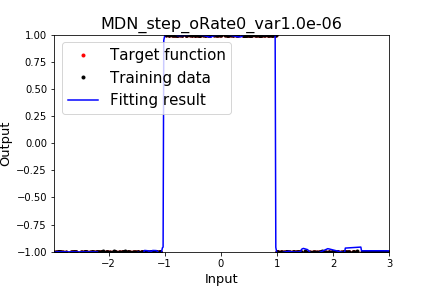</td><td>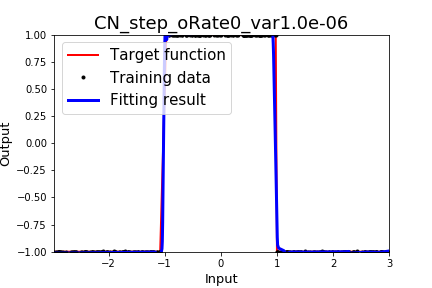</td></tr><tr><td>oRate: 10.0%</td><td>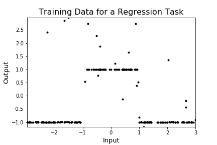</td><td></td><td>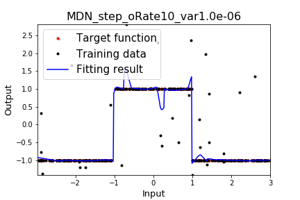</td><td>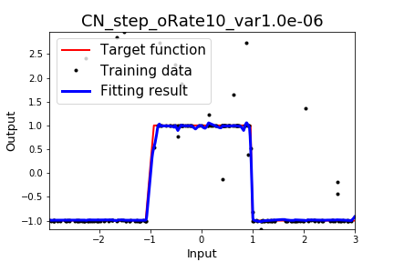</td></tr><tr><td>oRate: 30.0%</td><td></td><td>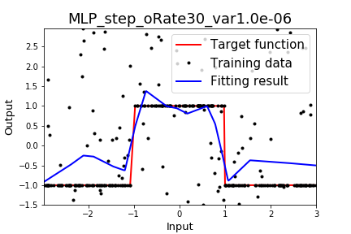</td><td>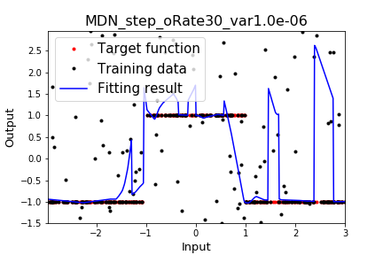</td><td>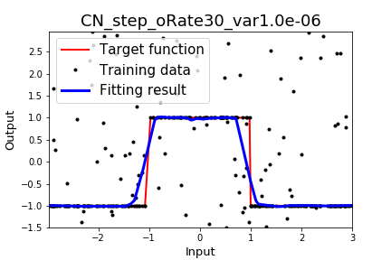</td></tr><tr><td>oRate: 50.0%</td><td></td><td>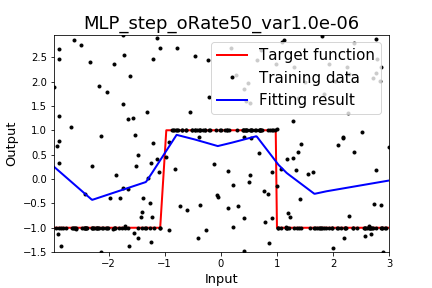</td><td>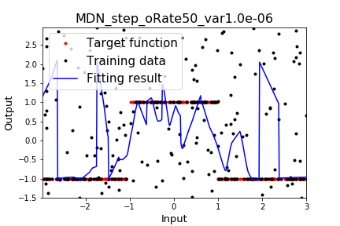</td><td>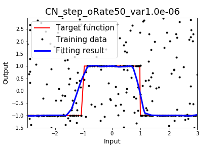</td></tr><tr><td>oRate: 60.0%</td><td></td><td>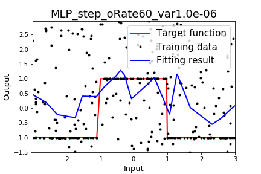</td><td>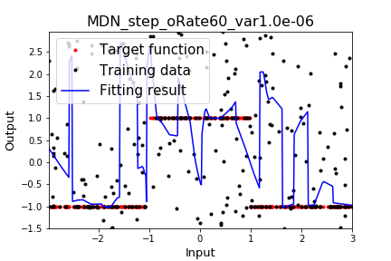</td><td></td></tr><tr><td>oRate: 70.0%</td><td></td><td></td><td></td><td></td></tr><br></body></table></html>

### HowTo?
- run code/main_reg_run.ipynb
- Properly modify followings based on the working environment:
```python
nWorker = 16
maxGPU  = 8
```
- (I was using 16 CPUs / 8 TESLA P40s / 96GB RAM.)

### Requirements
- Python3
- TF 1.4>= 

### Contact
- sungjoon.s.choi@gmail.com
- leo.brain@kakaobrain.com
- ian.theman@kakaobrain.com

This work was done in Kakao Brain. 
